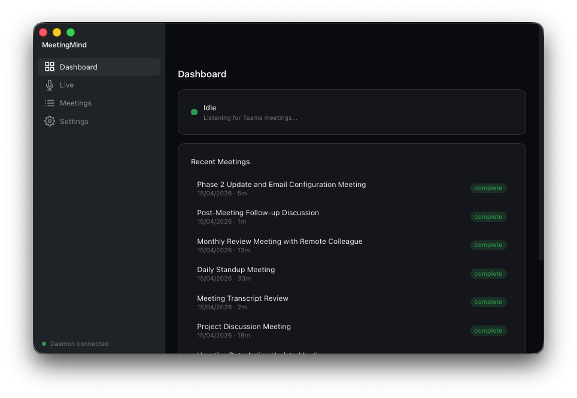

<p align="center">
  <h1 align="center">MeetingMind</h1>
  <p align="center">
    A macOS desktop app that automatically detects Microsoft Teams meetings, transcribes them locally, and produces structured AI-powered summaries — completely offline and invisible to other participants.
  </p>
</p>

<p align="center">
  
  
  
  
  
</p>

---

## Overview

MeetingMind runs silently in the background, watching for active Teams calls. When a meeting starts, it captures both sides of the conversation — remote participants via system audio loopback and your voice via the microphone — then runs the recording through local speech-to-text and an AI summariser to produce structured notes with action items, decisions, and key topics.

**Output formats:**
- **Markdown** — Obsidian-compatible `.md` files with YAML frontmatter (Dataview-queryable)
- **Notion** — Native database pages with headings, bullets, and to-do items

**Summarisation backends:**
- **Ollama** — Free, fully local, no API key needed
- **Claude API** — Anthropic's Claude for higher-quality summaries (requires API credits)

## How It Works

```
┌─────────────────────────────────────────────────────────────────────────┐
│                          MeetingMind Daemon (Python)                    │
│                                                                         │
│  ┌──────────┐    ┌──────────────┐    ┌──────────────┐    ┌───────────┐  │
│  │ Detector │───▶│Audio Capture │───▶│ Transcriber  │───▶│ Diariser  │  │
│  │ (macOS)  │    │(BlackHole +  │    │(faster-      │    │(Me vs     │  │
│  │          │    │ Microphone)  │    │ whisper)     │    │ Remote)   │  │
│  └──────────┘    └──────────────┘    └──────────────┘    └─────┬─────┘  │
│                                                                │        │
│  ┌────────────────┐    ┌────────────┐    ┌─────────────────────▼─────┐  │
│  │   REST API     │    │  WebSocket │    │      Summariser           │  │
│  │  (FastAPI)     │    │   Events   │    │   (Ollama / Claude)       │  │
│  └───────┬────────┘    └──────┬─────┘    └─────────────┬─────────────┘  │
│          │                    │                        │               │
│  ┌───────▼────────────────────▼─────┐    ┌─────────────▼─────────────┐  │
│  │         SQLite Database          │    │   Markdown / Notion       │  │
│  │   (meetings, transcripts, FTS)   │    │       Output              │  │
│  └──────────────────────────────────┘    └───────────────────────────┘  │
└─────────────────────┬───────────────────────────────────────────────────┘
                      │ REST + WebSocket (127.0.0.1:9876)
┌─────────────────────▼───────────────────────────────────────────────────┐
│                    MeetingMind Desktop App (Tauri + React)              │
│                                                                         │
│  Dashboard │ Meetings │ Live View │ Settings │ Onboarding │ System Tray │
└─────────────────────────────────────────────────────────────────────────┘
```

## Why Other Participants Can't Tell

Teams notifies participants when:
- A **recording is started via the Teams UI**
- A **bot joins** the meeting

MeetingMind does neither. It captures your local system audio via a loopback driver (BlackHole), which is functionally identical to listening through your speakers. No network traffic, no bot, no Teams API calls — from everyone else's perspective, nothing has changed.

> **Note:** Recording meetings may have legal implications depending on your jurisdiction. Many regions operate under "one-party consent" laws, meaning you can record a conversation you participate in. Verify the laws and policies that apply to you before use.

<!-- Screenshots (add when available)


-->

## Features

### Desktop App
- **Native macOS app** — Tauri v2 desktop app with system tray, dark/light themes, and native notifications
- **Meeting history** — Browse, search, and filter all recorded meetings with full-text search
- **Live view** — Real-time audio level meters, pipeline progress, and streaming transcript during recording
- **Audio player** — Waveform visualisation with playback controls, speed adjustment, and click-to-seek from transcript
- **Settings UI** — Full configuration through the app — no YAML editing required
- **Command palette** — Cmd+K to quickly search meetings, start recording, or jump to settings
- **Onboarding wizard** — Guided setup for BlackHole, audio devices, permissions, and model downloads
- **Model management** — Download and manage Whisper models with real-time progress
- **Auto-updates** — Built-in update checking via GitHub Releases
- **Accessible** — WCAG AA compliant with full keyboard navigation and screen reader support

### Pipeline
- **Automatic detection** — Monitors macOS process state and audio device usage with debounce to detect live Teams calls without manual intervention or false positives
- **Dual-source audio** — Records system audio (remote participants) and microphone (your voice) to separate files, then merges with RMS normalisation so both sides are equally audible
- **Local transcription** — Uses [faster-whisper](https://github.com/SYSTRAN/faster-whisper) (CTranslate2 backend) for fast, private, on-device speech-to-text
- **Speaker diarisation** — Energy-based labelling distinguishes your voice ("Me") from remote participants ("Remote") in the transcript — no ML dependencies
- **AI summarisation** — Produces structured summaries with title, key decisions, detailed action items (with full context, owners, deadlines, and subtasks), open questions, and topic tags
- **Multiple backends** — Choose between free local Ollama models or the Claude API for summarisation

### Output
- **Obsidian integration** — Markdown output with YAML frontmatter designed for Obsidian Dataview queries
- **Notion integration** — Creates native Notion database pages with proper headings, bullets, and to-do blocks
- **Export** — Export meetings as Markdown, JSON, or copy to clipboard
- **Data retention** — Configurable auto-cleanup of old audio files and meeting records

## Prerequisites

### 1. BlackHole (Virtual Audio Driver)

BlackHole creates a virtual audio device that captures system audio output via loopback.

```bash
brew install blackhole-2ch
```

After installation, create a **Multi-Output Device** in Audio MIDI Setup:

1. Open **Audio MIDI Setup** (Spotlight → "Audio MIDI Setup")
2. Click **+** → **Create Multi-Output Device**
3. Check both your real speakers/headphones **and** BlackHole 2ch
4. Set your real device as the clock source
5. Set this Multi-Output Device as your system output (System Settings → Sound → Output)

> **Important:** If you use a USB headset or external speakers, you must also configure **Teams** to use the Multi-Output Device (or "System Default") as its speaker output. Go to Teams → Settings → Devices → Speaker. If Teams sends audio directly to your headset, BlackHole won't capture it.

### 2. Ollama (Local AI — Recommended)

For free, fully local summarisation with no API key:

```bash
# Install Ollama
brew install ollama

# Pull a model (llama3.1:8b is a good default)
ollama pull llama3.1:8b

# Start the Ollama server (runs on port 11434)
ollama serve
```

> Alternatively, you can use the Claude API by setting `backend: "claude"` in the config and providing an Anthropic API key.

### 3. Python Environment

Requires Python 3.11+.

```bash
git clone https://github.com/JWhite212/meeting-mind.git
cd meeting-mind
python3 -m venv .venv
source .venv/bin/activate
pip install -r requirements.txt
```

### 4. Configuration

```bash
cp config.example.yaml config.yaml
```

Edit `config.yaml` to set:

| Setting | Description |
|---------|-------------|
| `summarisation.backend` | `"ollama"` (free, local) or `"claude"` (API) |
| `summarisation.ollama_model` | Ollama model name (e.g. `"llama3.1:8b"`) |
| `summarisation.anthropic_api_key` | Your Anthropic key (only if using Claude) |
| `markdown.vault_path` | Path to your Obsidian vault meetings folder |
| `audio.blackhole_device_name` | Usually `"BlackHole 2ch"` |
| `audio.mic_device_name` | Microphone name (empty = system default) |
| `audio.mic_volume` | Mic gain relative to system audio (`0.0`–`2.0`) |
| `audio.system_volume` | System audio gain after normalisation (`0.0`–`2.0`) |
| `diarisation.enabled` | `true` to label speakers as "Me" / "Remote" |

See [`config.example.yaml`](config.example.yaml) for the full reference with all options documented.

## Usage

### Daemon Mode (Auto-Detect Meetings)

```bash
python3 -m src.main
```

Polls for active Teams calls and automatically starts/stops recording. Intended for always-on background use. Detection uses debounce (3 consecutive positive polls over ~9 seconds) to prevent false positives.

### Manual Recording

```bash
python3 -m src.main --record-now
```

Starts recording immediately without waiting for Teams detection. Press `Ctrl+C` to stop — the recording is then transcribed and summarised.

### Process Existing Audio

```bash
python3 -m src.main --process /path/to/audio.wav
```

Skip recording entirely and run an existing audio file through the transcription → summarisation → output pipeline.

### Run as a Launch Agent (Auto-Start on Login)

```bash
# Edit com.meetingmind.agent.plist to set your actual paths, then:
cp com.meetingmind.agent.plist ~/Library/LaunchAgents/
launchctl load ~/Library/LaunchAgents/com.meetingmind.agent.plist
```

To stop:

```bash
launchctl unload ~/Library/LaunchAgents/com.meetingmind.agent.plist
```

## Output

### Markdown

Each meeting produces a file like:

```
~/Documents/Meetings/2026-04-08_quarterly-planning-review.md
```

```yaml
---
title: "Quarterly Planning Review"
date: 2026-04-08
time: 14:30
duration_minutes: 45
tags: ["roadmap", "hiring", "q3-planning"]
type: meeting-note
---
```

Followed by the AI-generated summary with sections for:

- **Summary** — High-level overview of what was discussed and why it matters
- **Key Decisions** — Decisions made during the meeting
- **Action Items** — Each action item includes full context, specific requirements, owner, deadline, and concrete subtasks
- **Open Questions** — Unresolved topics for follow-up
- **Full Transcript** — Timestamped and speaker-labelled transcript (`[00:01:23] [Remote] So the quarterly numbers show...`)

### Notion

A new page is created in your configured Notion database with:
- **Properties:** Title, Date, Tags (multi-select), Status
- **Content:** Native Notion blocks — headings, bullets, and to-do items (not raw Markdown)

## Audio Pipeline

MeetingMind records system audio and microphone to **separate WAV files** using independent audio streams, then merges them after capture with RMS normalisation. This design:

- **Eliminates clock drift** — Two hardware devices (e.g. BlackHole virtual device and USB headset) run on independent clocks. Real-time mixing causes progressive desynchronisation. Separate files avoid this entirely.
- **Balances volume levels** — System audio (remote participants) is typically much quieter than a close-range microphone. Post-capture normalisation brings both sources to the same RMS level before mixing.
- **Enables speaker diarisation** — The separate source files allow energy-based comparison to determine who was speaking in each segment.

## Speaker Diarisation

When enabled, MeetingMind labels each transcript segment with a speaker identifier by comparing the RMS energy between the system audio and microphone recordings for each time window:

- If the mic is significantly louder → **"Me"** (you were speaking)
- If the system audio is significantly louder → **"Remote"** (another participant was speaking)
- If both are similar → **"Me + Remote"** (crosstalk)

This produces transcripts like:

```
[00:01:23] [Remote] So the quarterly numbers show a 15% increase...
[00:01:45] [Me] Right, and I think we should focus on the enterprise segment.
[00:02:10] [Remote] Agreed. Let's draft the proposal by Friday.
```

The summariser uses these labels to correctly attribute statements, decisions, and action items to the right participants.

> **Tip:** Diarisation works best with headsets (like USB headsets) that isolate your mic from system audio. With open speakers, crosstalk reduces accuracy.

## Configuration Reference

<details>
<summary><strong>Full config.example.yaml</strong></summary>

```yaml
# Meeting Detection
detection:
  poll_interval_seconds: 3         # How often to check for active calls
  min_meeting_duration_seconds: 30 # Ignore very short calls
  required_consecutive_detections: 3  # Debounce: consecutive polls before recording
  process_names:                   # Teams process names to monitor
    - "Microsoft Teams"
    - "MSTeams"
    - "Teams"

# Audio Capture
audio:
  blackhole_device_name: "BlackHole 2ch"
  mic_device_name: ""              # Empty = system default microphone
  mic_enabled: true                # Capture your voice alongside system audio
  mic_volume: 1.0                  # 0.0–2.0 gain for microphone input
  system_volume: 1.0               # 0.0–2.0 gain for system audio after normalisation
  sample_rate: 16000               # 16kHz mono — optimal for Whisper
  channels: 1
  temp_audio_dir: "/tmp/meetingmind"
  keep_source_files: false         # Keep separate WAVs (auto-enabled with diarisation)

# Transcription
transcription:
  model_size: "small.en"           # tiny.en | base.en | small.en | medium.en | large-v3
  compute_type: "auto"             # int8 on Apple Silicon
  language: "en"                   # "auto" for language detection
  cpu_threads: 0                   # 0 = auto-detect
  vad_threshold: 0.35              # 0.0–1.0, lower keeps more audio (default Whisper: 0.5)

# Summarisation
summarisation:
  backend: "ollama"                # "ollama" or "claude"
  ollama_base_url: "http://localhost:11434"
  ollama_model: "llama3.1:8b"
  anthropic_api_key: "sk-ant-..."  # Only needed for backend: claude
  model: "claude-sonnet-4-20250514"
  max_tokens: 4096

# Speaker Diarisation
diarisation:
  enabled: false                   # Label speakers as "Me" vs "Remote"
  speaker_name: "Me"               # Your label in the transcript
  remote_label: "Remote"           # Remote participants' label
  energy_ratio_threshold: 1.5      # How decisive the energy comparison must be

# Output: Markdown
markdown:
  enabled: true
  vault_path: "~/Documents/Meetings"
  filename_template: "{date}_{slug}.md"
  include_full_transcript: true

# Output: Notion
notion:
  enabled: false
  api_key: "ntn_..."
  database_id: ""
  properties:
    title: "Name"
    date: "Date"
    tags: "Tags"
    status: "Status"

# Logging
logging:
  level: "INFO"
  log_file: "~/Library/Logs/meetingmind.log"
```

</details>

## Project Structure

```
meeting-mind/
├── config.example.yaml              # Config template (tracked)
├── meetingmind.spec                 # PyInstaller build spec
├── pyproject.toml                   # Project metadata, pytest & ruff config
├── com.meetingmind.agent.plist      # launchd agent for auto-start
├── scripts/
│   ├── build_daemon.sh              # Build standalone daemon binary
│   └── bump_version.sh              # Sync version across all manifests
├── src/
│   ├── __main__.py                  # Entry point for frozen binary
│   ├── main.py                      # Orchestrator (MeetingMind class)
│   ├── detector.py                  # State machine + debounce logic
│   ├── audio_capture.py             # Dual-source audio recording + merge
│   ├── transcriber.py               # faster-whisper speech-to-text
│   ├── diariser.py                  # Energy-based speaker labelling
│   ├── summariser.py                # AI summarisation (Ollama / Claude)
│   ├── platform/
│   │   ├── detector.py              # PlatformDetector protocol + factory
│   │   ├── macos.py                 # macOS detection (pgrep, lsof, osascript)
│   │   ├── linux.py                 # Linux stub (not yet implemented)
│   │   └── windows.py               # Windows stub (not yet implemented)
│   ├── api/
│   │   ├── server.py                # FastAPI app + background thread
│   │   ├── auth.py                  # HMAC token authentication
│   │   ├── schemas.py               # Pydantic response models
│   │   ├── events.py                # EventBus (sync/async pub-sub)
│   │   ├── websocket.py             # WebSocket connection manager
│   │   └── routes/
│   │       ├── status.py            # GET /api/health, /api/status
│   │       ├── meetings.py          # CRUD /api/meetings
│   │       ├── recording.py         # POST /api/record/start, /stop
│   │       ├── config.py            # GET/PUT /api/config
│   │       ├── devices.py           # GET /api/devices
│   │       ├── models.py            # GET /api/models, POST download
│   │       ├── export.py            # POST /api/export/{id}
│   │       └── resummarise.py       # POST /api/meetings/{id}/resummarise
│   ├── db/
│   │   ├── database.py              # SQLite + FTS5 schema
│   │   └── repository.py            # Meeting CRUD + search + retention
│   ├── output/
│   │   ├── markdown_writer.py       # Obsidian-compatible .md output
│   │   └── notion_writer.py         # Notion database page output
│   └── utils/
│       └── config.py                # YAML config loader (typed dataclasses)
├── tests/
│   ├── conftest.py                  # Shared fixtures (tmp DB, config, EventBus)
│   ├── test_config.py               # Config loading and validation
│   ├── test_repository.py           # Meeting CRUD, search, retention
│   ├── test_events.py               # EventBus sync/async callbacks
│   ├── test_platform.py             # Platform factory and protocol
│   └── test_api.py                  # API integration tests (httpx)
├── ui/                              # Tauri + React desktop app
│   ├── src/
│   │   ├── App.tsx                  # Router + layout
│   │   ├── components/
│   │   │   ├── dashboard/           # Dashboard with stats and recent meetings
│   │   │   ├── meetings/            # MeetingList, MeetingDetail, AudioPlayer
│   │   │   ├── live/                # LiveView (real-time transcript + meters)
│   │   │   ├── settings/            # Settings UI with all config sections
│   │   │   ├── onboarding/          # Setup wizard (permissions, devices, models)
│   │   │   ├── layout/              # Sidebar navigation
│   │   │   └── common/              # Toast, Skeleton, Tooltip, CommandPalette
│   │   ├── hooks/                   # useDaemonStatus, useWebSocket, useTheme
│   │   ├── stores/                  # Zustand state management
│   │   └── lib/                     # API client, types, constants
│   └── src-tauri/
│       ├── src/lib.rs               # Tauri commands (auth, updates, daemon path)
│       ├── src/tray.rs              # System tray with dynamic menu
│       └── tauri.conf.json          # App config, bundling, updater
└── .github/workflows/
    ├── test.yml                     # CI: lint + pytest + TypeScript check
    └── release.yml                  # CD: build daemon → build app → GitHub Release
```

## Tech Stack

| Layer | Technology |
|-------|-----------|
| **Desktop app** | [Tauri v2](https://v2.tauri.app/) (Rust) + [React](https://react.dev/) + [TypeScript](https://www.typescriptlang.org/) |
| **Styling** | [Tailwind CSS](https://tailwindcss.com/) |
| **State management** | [Zustand](https://zustand.docs.pmnd.rs/) + [React Query](https://tanstack.com/query) |
| **Animations** | [Framer Motion](https://www.framer.com/motion/) |
| **Daemon API** | [FastAPI](https://fastapi.tiangolo.com/) + WebSocket |
| **Database** | SQLite + FTS5 (via [aiosqlite](https://github.com/omnilib/aiosqlite)) |
| **Audio capture** | [sounddevice](https://python-sounddevice.readthedocs.io/) + [BlackHole](https://existential.audio/blackhole/) |
| **Transcription** | [faster-whisper](https://github.com/SYSTRAN/faster-whisper) (CTranslate2) |
| **Summarisation** | [Ollama](https://ollama.com/) or [Claude API](https://docs.anthropic.com/) |
| **Diarisation** | Energy-based RMS comparison (numpy) |
| **Packaging** | [PyInstaller](https://pyinstaller.org/) (daemon binary) |
| **CI/CD** | GitHub Actions (test, build, release) |
| **Platform** | macOS (BlackHole, pgrep, lsof, osascript) |

## Development

### Prerequisites

- Python 3.11+
- Node.js 20+
- Rust (latest stable)
- [BlackHole 2ch](https://existential.audio/blackhole/)

### Backend (daemon)

```bash
python3 -m venv .venv
source .venv/bin/activate
pip install -r requirements.txt -r requirements-dev.txt

# Run daemon in dev mode
python3 -m src.main

# Run tests
pytest -v

# Lint
ruff check src/ tests/
```

### Frontend (desktop app)

```bash
cd ui
npm install

# Dev mode (starts Vite + Tauri)
npm run tauri dev

# Type check
npx tsc --noEmit
```

### API Documentation

The daemon serves interactive API docs at [http://localhost:9876/docs](http://localhost:9876/docs) (Swagger UI) when running.

## Building

### Daemon Binary (PyInstaller)

```bash
./scripts/build_daemon.sh
# Output: dist/meetingmind-daemon/meetingmind-daemon
```

### Desktop App (Tauri)

```bash
# Copy daemon binary into Tauri resources first
cp -r dist/meetingmind-daemon ui/src-tauri/resources/

# Build the .app / .dmg
cd ui && npm run tauri build
```

### Version Bumping

```bash
./scripts/bump_version.sh 0.2.0
# Updates tauri.conf.json, Cargo.toml, and package.json
```

## Troubleshooting

### No audio captured (silent recording)

1. Verify BlackHole is installed: `brew list blackhole-2ch`
2. Check your system output is set to the Multi-Output Device (not directly to speakers)
3. **Check Teams' speaker setting** — go to Teams → Settings → Devices → Speaker and ensure it's set to "Multi-Output Device" or "System Default". If Teams sends audio directly to your headset, BlackHole won't capture it.
4. Run `python3 -m sounddevice` to confirm BlackHole appears as an input device
5. Verify audio is flowing:

```bash
python3 -c "
import sounddevice as sd, numpy as np
data = sd.rec(int(3 * 16000), samplerate=16000, channels=2, device='BlackHole 2ch', dtype='float32')
sd.wait()
peak = np.max(np.abs(data))
print(f'Peak amplitude: {peak:.6f}')
print('Signal detected' if peak > 0.001 else 'SILENT — check audio routing')
"
```

### VAD removes all audio

The faster-whisper VAD filter discards segments it classifies as silence. If your audio is very quiet, the entire recording may be filtered out. Try lowering `transcription.vad_threshold` in your config (default: `0.35`, lower is less aggressive). Check that the Multi-Output Device is configured correctly and that your system volume is not muted.

### Daemon detects a meeting when Teams is just open

The detector requires multiple consecutive positive polls (default: 3, or ~9 seconds) before triggering. If false positives persist, increase `detection.required_consecutive_detections` in your config.

### Ollama connection refused

Ensure the Ollama server is running (`ollama serve`) and listening on the configured port (default: `http://localhost:11434`).

### Diarisation labels are inaccurate

- Use a headset with good mic isolation for best results. Open speakers cause crosstalk.
- Adjust `diarisation.energy_ratio_threshold` — lower values (e.g. `1.2`) are more decisive, higher values (e.g. `2.0`) require a bigger energy difference.

## License

MIT
